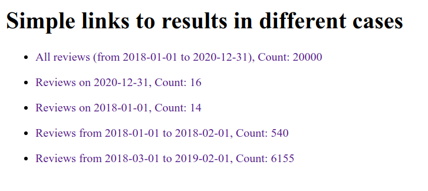

# Shamseya  Task

## What's implemented

**The Required:**

- `api/core/reviews/` endpoint that returns all the reviews by default
  - in this shape:

  ```JSON
  {
    "2020-12-31": { // submitted_at field
        "count": 16,  // reviews count field
        "answer_count": 64, // answers count
        "answer_ids": [  // answers ids
            3149,
            3150,
            3151,
            3152,
            10153,
            10154,
            10155,
            10156,
            ...
        ]
    }
  }
  ```

  - I collect by date, return their count, and merge all the answers for all the reviews in the specific date, and put their count
  - *Since the shape of the data is not explicitly specified, I did what I saw suitable, and easier for me to implement.*
  - *I also return IDs only, because no need for more information explicitly required*
- filter reviews by `from_date` & `to_date` query params
  - both are optional, this is tested, too.
- I did not write units to test the shape of the data in different cases, did that manually

**The Bonus:**

- The endpoint is protected. Allowed for logged-in (authenticated) users only.
  - This is satisfied with this permission `IsAuthenticated`
- There're three users in the attached dataset
  - you can also create them using `create_users` command
  - refer to their passwords [here](#available-users)
- Then Added another restriction
  - A User must be an AdminUser (staff) or SuperUser
  - This implemented using these permissions `IsAdminUser | IsSuperUser`
- The previous points are satisfied with this python statement:
  `permission_classes = (IsAuthenticated, IsAdminUser | IsSuperUser)` in the Review APIView
  - They're tested to make sure they work as required: [test_views](./shamseya_task/core/tests/test_api/test_views.py)
- I usually dockerize PostgreSQL, and that's what I did, since it's a bonus part I don't have the desire to do more configurations.

**Extra:**

- Home view (`/`) to try different results using quick links to the api endpoint
  - This was easier for me during the manual test, and might be useful for you

- I also use Debug Tool Bar to monitor the performance

- Plus some other helper commands to help me generate data
- And lastly, some other boilerplate code from the [Template project](https://github.com/shahwan42/django-project) I'm using. Not harmful though.

## Pre-requisites (On Ubuntu)

- Python 3.6
- docker & docker-compose

## Run

- clone the project
- cd into project's directory
- create a python virtualenv and activate it
- `$ python -m pip install poetry` I use it to manage he dependencies of my projects
- `$ poetry install` install project dependencies inside the venv
- `$ cp .env.example .env`
- `$ docker-compose up` to run postgres container
- `$ ./manage.py test` to run tests
- `$ ./manage.py migrate` to apply migrations
- `$ ./manage.py loaddata fixtures/4krev.db` to load 4K Reviews Dataset
  - There're other datasets you can use, too.
- `$ ./manage.py runserver 8005` to run server
- Authenticate a user using any of the [available users](#available-users) trough the [login route](#authentication-routes)
- Open `http://localhost:8005/` you'll find quick links to try different results
- Or navigate to `http://localhost:8005/api/core/reviews/` directly

## Available users

- usernames: `super_user`, `super_only`, `staff_user`, `active_user`
- password (same for all): `Awesome1`

## Authentication routes

- `/api/auth/login/`
- `/api/auth/logout/`

## Thoughts on performance

I think I've reached the best performance for now,

Results from [Debug Tool Bar](https://github.com/jazzband/django-debug-toolbar) (16K Reviews Dataset):

 

- The Query is very fast, but the browser rendering (Browsable API) for the response takes time,
we can solve that using Pagination.
- Also we could use Postgres Materialized Views to make just one select statement (for larger datasets, 20K+)
  - A helper for that would be this package: [https://github.com/mypebble/django-pgviews](https://github.com/mypebble/django-pgviews)
  - we'll also need pagination for better user experience

## More commands

- `$ ./manage.py populate_db` add sample db records (takes time)
- `$ ./manage.py clean_db` remove all db entries

## Thank you
