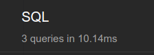
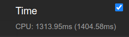

# Shamseya  Task

## Pre-requisites (On Ubuntu)

- Python 3.6
- docker & docker-compose

## Run

- clone the project
- cd into project's directory
- create a python virtualenv and activate it (choose one of the following approaches)
  - `$ python -m venv .venv && source .venv/bin/activate`
  - `$ mkvirtualenv shamseya-task`
  - `$ poetry install && poetry shell` (will automatically create a venv and install the deps (needs poetry installed), skip following 2 steps after this approach)
- `$ python -m pip install poetry`
- `$ poetry install` install project dependencies inside the venv
- `$ cp .env.example .env`
- `$ docker-compose up` to run postgres container
- `$ ./manage.py test` to run tests
- `$ ./manage.py migrate` to apply migrations
- `$ ./manage.py loaddata fixtures/4krev.db` to load 4K Reviews Dataset
- `$ ./manage.py loaddata fixtures/8krev.db` to load 8K Reviews Dataset
- `$ ./manage.py loaddata fixtures/12krev.db` to load 12K Reviews Dataset
- `$ ./manage.py loaddata fixtures/16krev.db` to load 16K Reviews Dataset
- `$ ./manage.py loaddata fixtures/20krev.db` to load 20K Reviews Dataset
- `$ ./manage.py runserver 8005` to run server
- Authenticate a user using any of the [available users](#available-users) trough the [login route](#authentication-routes)
- Open `http://localhost:8005/` you'll find quick links to try different results
- Or navigate to `http://localhost:8005/api/core/reviews/`
- Or use Postman or [vs code](#test-from-inside-vs-code) to test the endpoint (provide Basic Auth: user&pass)

## Available users

- usernames: `super_user`, `super_only`, `staff_user`, `active_user`
- password (same for all): `Awesome1`

## Authentication routes

- `/api/auth/login/`
- `/api/auth/logout/`

## Thoughts on performance

I think I've reached the best performance for now,

Results from [Debug Tool Bar](https://github.com/jazzband/django-debug-toolbar) (16K Reviews Dataset):

 

- The Query is very fast, but the browser rendering (Browsable API) for the response takes time,
we can solve that using Pagination.
- Also we could use Postgres Materialized Views to make just one select statement (for larger datasets, 20K+)
  - A helper for that would be this package: [https://github.com/mypebble/django-pgviews](https://github.com/mypebble/django-pgviews)
  - we'll also need pagination for better user experience

## More commands

- `$ ./manage.py populate_db` add sample db records (takes time)
- `$ ./manage.py clean_db` remove all db entries

## Test from inside VS Code

- make sure [REST Client extension](https://marketplace.visualstudio.com/items?itemName=humao.rest-client) is installed
- make sure db container & django server are running
- open the `api.http` file
- make requests and see responses :))

## Thank you
